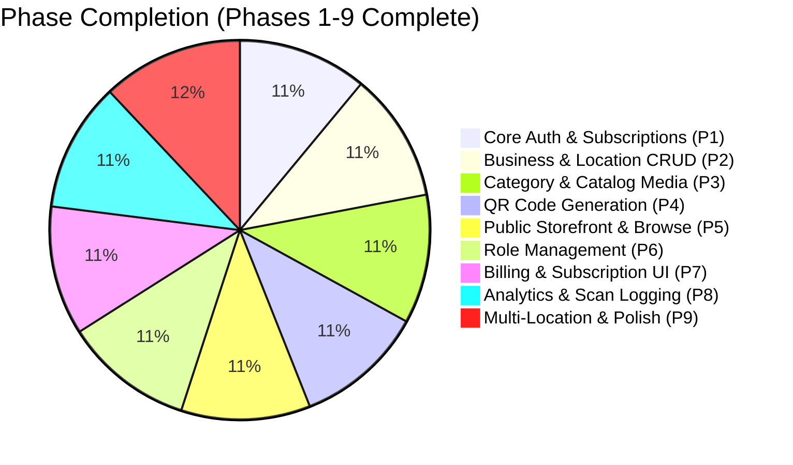
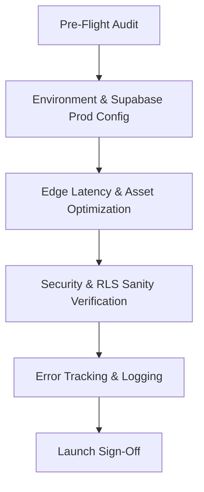
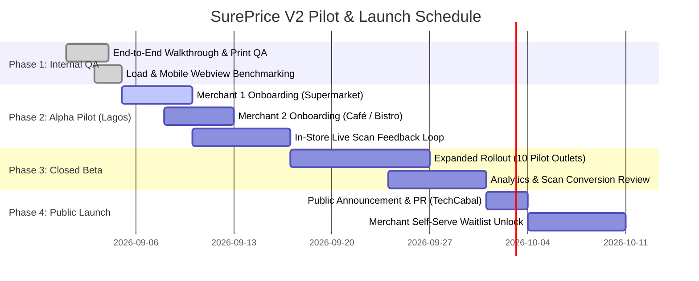
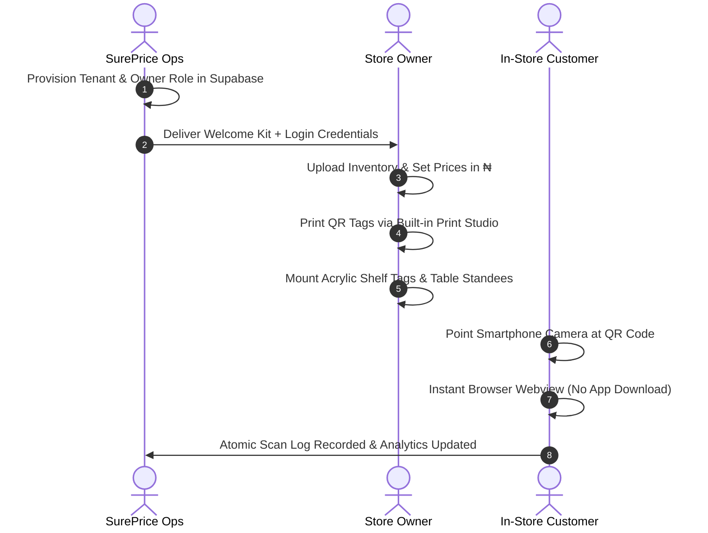
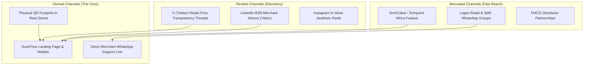

# SurePrice V2 — Project Closeout & Launch Preparation Master Chart

**Project:** SurePrice V2  
**Target Market:** Physical Retail, Supermarkets, Restaurants, Cafés & Pop-Up Vendors (Lagos & Nigeria)  
**Status:** Build Complete & Audited (Phases 1–9 Passed) $\rightarrow$ **Pilot & Launch Readiness Phase**  
**Operating Currency:** Nigerian Naira (₦)  
**Primary Surfaces:** Merchant Admin Dashboard (Geist) & Consumer Scan Webview (General Sans)

---

## 1. Project Closeout Status & Build Audit Summary

| Phase | Description | Architecture / Implementation | Status | Sign-off Note |
| :--- | :--- | :--- | :---: | :--- |
| **Phase 1** | Auth & Permissions | Next.js 16 App Router, `@supabase/ssr`, role-based redirect, subscription gate | `COMPLETED` | Verified |
| **Phase 2** | Business & Location CRUD | Multi-tenant organization scoping, location CRUD, runtime enum checks | `COMPLETED` | Verified |
| **Phase 3** | Category & Catalog CRUD | JSONB key-value attributes, `media` table primary image sync, Supabase Storage | `COMPLETED` | Verified |
| **Phase 4** | QR Generation & Resolution | NanoID QR generation, dynamic vector QR rendering, `/q/[code]` redirect | `COMPLETED` | Verified |
| **Phase 5** | Public Storefront | Instant sub-second webview, category tabs, filter & search, responsive layout | `COMPLETED` | Verified |
| **Phase 6** | Team & Access Control | `role_assignments` table, `can_manage_*` RPCs, manual Supabase assignment | `COMPLETED` | Pilot mode enforced |
| **Phase 7** | Billing & Subscription UI | Plan indicators, trial tracking, Nigerian billing placeholder structure | `COMPLETED` | Payments physical in V1 |
| **Phase 8** | Merchant Analytics | Atomic scan incrementing (`record_scan_and_increment`), 7-day trend chart | `COMPLETED` | Verified |
| **Phase 9** | Polish & Multi-Location | Location switcher, light-mode glassmorphism, responsive tap targets | `COMPLETED` | Verified |

> [!NOTE]
> **Pilot Mode Constraints Maintained:**
> - Public self-signup is disabled for pilot control; merchant accounts are pre-provisioned.
> - Staff invite flow button is disabled for pilot; team assignments are managed directly in Supabase.
> - Payments remain physical in-store; V1 platform monetization runs on subscription tiers.

---

## 2. Technical & Infrastructure Release Gates

| Gate # | Check Area | Item / Requirement | Target Metric | Status |
| :---: | :--- | :--- | :--- | :---: |
| **TG-01** | **Environment Config** | Production Supabase URL, anon key, service-role key separated | Zero server keys in client bundles | `READY` |
| **TG-02** | **Storage & CDN** | Public bucket `catalog-media` cache-control header set to 30d | Image load $< 300\text{ms}$ on 4G | `READY` |
| **TG-03** | **Scan Latency** | `/q/[code]` resolution time on mobile networks (MTN, Airtel) | Total redirect + render $< 750\text{ms}$ | `READY` |
| **TG-04** | **Database RPCs** | `record_scan_and_increment` atomic execution under concurrency | Zero race condition row locks | `READY` |
| **TG-05** | **RLS Security** | Cross-tenant isolation across all `businesses`, `locations`, `catalog_items` | Zero multi-tenant leaks | `PASSED` |
| **TG-06** | **Offline Fallback** | Shopper offline or poor cell connection handling (`Offline.jpeg` state) | Graceful cached UI display | `READY` |

---

## 3. Physical Hardware & Print Studio Verification

Physical QR scanning in retail aisles requires testing against real-world lighting, reflections, and distances.

| Format | Physical Medium | Dimensions | Use Case | QA Checklist |
| :--- | :--- | :--- | :--- | :---: |
| **Shelf Tag** | PVC / Cardstock + Acrylic Holder | $70\text{mm} \times 40\text{mm}$ | Supermarket shelf rails | [ ] Scans from $30\text{cm} - 1\text{m}$ [ ] High-contrast black on white [ ] Currency symbol (₦) visible |
| **Product Sticker** | Waterproof Matte Vinyl | $40\text{mm} \times 40\text{mm}$ | Direct product packaging / bottles | [ ] Curved surface scan test [ ] Glare resistance under fluorescent lighting |
| **Table Standee** | A6 Acrylic Tent Card | $105\text{mm} \times 148\text{mm}$ | Restaurant & Café dining tables | [ ] Scans from seated angle [ ] Menu title + Table ID prominent |
| **A4 Sheet Grid** | Standard A4 Laser Sheet | 210mm $\times$ 297mm (12/24 grid) | Batch merchant back-office printing | [ ] Cut guide alignment [ ] Micro-QR crispness |

---

## 4. Phased Launch Timeline & Milestone Chart

---

## 5. Pilot Merchant Onboarding & Operational Runbook

### Pilot Merchant Day-1 Checklist

1. **Account Pre-Provisioning:** Create merchant organization and assign `owner` role via Supabase SQL script.
2. **Catalog Import / Seeding:** Bulk or 1-by-1 item creation with accurate Naira pricing, category tags, and primary image upload.
3. **Physical Tag Placement:** Print batch tags via the Print Studio, laminate or insert into acrylic shelf clips.
4. **Staff Orientation:** 5-minute briefing to store cashiers/floor staff ("If a customer asks about the QR code, tell them to point their camera for instant pricing and specs").
5. **Real-Time Price Change Test:** Have the owner change one item price from the dashboard and verify immediate reflection on the shopper webview ($< 1\text{s}$).

---

## 6. ORB Go-To-Market Strategy (Launch Marketing)

- **Owned Channels:** The primary owned channel is the **physical QR code in stores**—every shopper scan exposes the footer brand *"Powered by SurePrice — Get this for your store"*, creating a natural viral loop.
- **Rented Channels:** Short video demos showing a store owner updating an inflation-impacted price in 3 seconds on a phone vs. re-stickering 500 shelf tags.
- **Borrowed Channels:** Partnering with retail POS consultants, supermarket fitout providers, and SME associations in Lagos/Abuja.

---

## 7. Operational Incident & Monitoring Matrix

| Trigger / Alert | Impact | Immediate Action | Escalation Contact |
| :--- | :--- | :--- | :--- |
| **Supabase Storage Latency Spike** | Item images load slowly on shopper webviews | Ensure client-side image skeleton fallback; verify CDN caching | Engineering Lead |
| **Invalid / Unresolved QR Scan** | Shopper scans unlinked or archived code | Render friendly `Invalid QR Code.jpeg` screen with search fallback | Support Ops |
| **Merchant Login Lockout** | Owner forgets password | Reset via Supabase Auth admin console; send direct magic link | Support Hotline |
| **High Concurrency Scan Peak** | Major festival/pop-up event traffic spike | RPC connection pooling verified; Supabase auto-scaling check | Engineering Lead |

---

## 8. Launch Sign-Off Authority

- [x] **Frontend & UI Fidelity:** Passes all Design System standards (Light glassmorphism, General Sans / Geist typography).
- [x] **Backend & Data Integrity:** RLS policies enforced, zero raw text casting, RPC permissions intact.
- [ ] **Physical Print QA:** Sample acrylic shelf tags and table standees printed and tested under retail lighting.
- [ ] **Pilot Cohort Confirmation:** 2 Alpha pilot merchants confirmed in Lagos (Supermarket + Dining).
- [ ] **Support Channel Readiness:** WhatsApp Business helpline configured for instant pilot merchant assistance.
