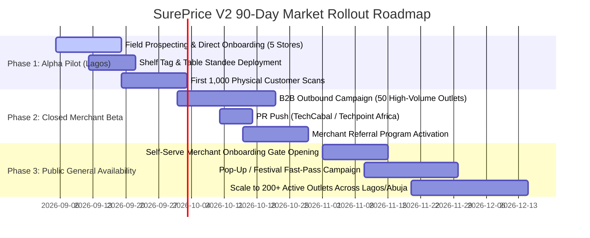
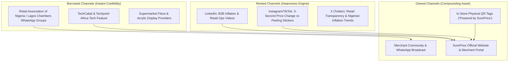

# SurePrice V2 — Market Rollout Execution Playbook

**Target Region:** Lagos, Abuja & Urban Nigeria  
**Launch Focus:** Physical Retailers, Supermarkets, Cafés, Bistros & Pop-Up Festival Stalls  
**Monetization:** B2B Merchant Subscription (Payments stay physical in V1)  
**Positioning:** 1-Tap Real-Time Cloud Price Updates in ₦ with Zero-App-Download QR Scanning

---

## 1. Phased Market Rollout Timeline (90-Day Plan)



---

## 2. Priority ICP Segments & Field Targeting in Lagos

| Segment | Ideal Merchant Profile | High-Density Lagos Locations | Core Value Pitch |
| :--- | :--- | :--- | :--- |
| **Tier 1: High-Volume Supermarkets** | 500–5,000 SKUs, multiple checkout lanes, frequent supplier price hikes. | Lekki Phase 1, Victoria Island, Ikeja GRA, Surulere. | *"Stop spending 3 hours every morning re-stickering shelves. Update any item in 1 tap from your phone."* |
| **Tier 2: Dining, Cafés & Bistros** | Sit-down dining, counter order cafés, weekend brunch spots. | Ikoyi, Lekki Admiralty Way, Victoria Island. | *"Eliminate ₦150k quarterly menu reprint costs. Toggle dish availability and seasonal specials live."* |
| **Tier 3: Pop-Up & Festival Vendors** | Weekend craft/food markets (EatDrinkLagos, Art X, GTCO Fair). | Landmark Beach, Balmoral Hall, Muri Okunola Park. | *"Generate your entire digital price tag catalog in 10 minutes. Customers scan and order without crowding your counter."* |

---

## 3. High-Converting Outbound Outreach Scripts

### WhatsApp Outreach (Direct to Store Owner / General Manager)
*Why WhatsApp? In Nigeria, 95%+ of retail decision-makers conduct business discussions via WhatsApp.*

> **Subject / Opening:** Quick question regarding shelf pricing at [Store Name]
>
> "Good day [Owner/Manager Name], 
>
> I was at your [Location/Area] branch and noticed your team has to constantly update price tags with stickers whenever supplier costs change.
>
> We built **SurePrice** specifically for retail owners in Lagos:
> 1. You update any product price on your phone in 1 second.
> 2. Customers scan the shelf tag QR code with their normal phone camera — **zero app download**.
> 3. Eliminates checkout disputes when a sticker price doesn't match the register.
>
> We are onboarding 5 flagship stores in [Location/Area] this week with full shelf tag printing included for free.
>
> Can I drop by for 7 minutes on [Day, e.g. Thursday] to show you a live 1-second price update demo on an acrylic shelf tag?"

---

### B2B Email Outreach (For Corporate Supermarket Chains & Restaurant Groups)

> **Subject:** Eliminating price sticker fatigue & checkout disputes at [Company Name]
>
> **Hi [First Name],**
>
> With frequent inflation adjustments across FMCG and dining suppliers, keeping physical shelf tags in sync with POS systems has become a daily operational headache.
>
> **SurePrice** replaces static paper stickers with dynamic, cloud-synced QR price tags:
> - **1-Tap Cloud Sync:** Update a price once; it reflects immediately on the digital tag across all branches.
> - **Zero Friction for Shoppers:** Customers point their camera and see verified prices in Naira without installing any app.
> - **In-Store Analytics:** Track which aisles and items receive the most daily foot-traffic attention.
>
> We have pre-configured a digital price demonstration for [Company Name]. Would you be open to a 10-minute walkthrough this week?
>
> Best regards,  
> **[Your Name]**  
> Founder / Launch Lead, SurePrice Nigeria

---

## 4. ORB Distribution & Marketing Channel Architecture



### The In-Store Viral Flywheel (Owned Channel #1)
Every physical tag printed in a store carries the consumer-facing footer:  
`"Powered by SurePrice · Zero App Download · Get SurePrice for your store"`.  
When other business owners or store managers shop at a pilot store and scan a product, they are funneled directly to the merchant registration waitlist.

---

## 5. PR & Earned Media Angle (TechCabal / Techpoint Africa Pitch)

**Headline:** *SurePrice Launches in Lagos to Cure Nigeria's Retail 'Price Tag Shock' with Cloud-Powered In-Store QR Tags*

**Story Spine:**
1. **The Context:** Nigeria's rapid inflation has created an unprecedented operational burden for physical store owners who spend hours every week re-labeling thousands of items.
2. **The Innovation:** SurePrice introduces a digital software layer over physical stores. Instead of buying expensive Electronic Shelf Label (ESL) hardware from overseas, merchants print standardized acrylic QR tags and update prices from their smartphones in 1 tap.
3. **The Shopper Experience:** Zero app downloads. Shoppers point their iPhone or Android camera to instantly see verified prices, product specifications, and 30-day price trends.

---

## 6. Sales Enablement: 1-Page Merchant ROI Leave-Behind

```
┌────────────────────────────────────────────────────────────────────────┐
│                        SUREPRICE NIGERIA                               │
│            Digital Price Tags & Menus for Modern Retail                │
├────────────────────────────────────────────────────────────────────────┤
│                                                                        │
│  ❌ THE OLD WAY (PAPER STICKERS & PRINTED MENUS)                       │
│  • 10–15 hours weekly spent manually stickering shelf prices           │
│  • Cashier checkout arguments: "The shelf said ₦4,500, not ₦5,200!"    │
│  • ₦100,000+ wasted on printed menu re-runs every quarter              │
│  • Zero data on what products shoppers actually look at                │
│                                                                        │
│  ✅ THE SUREPRICE WAY (1-TAP CLOUD PRICE TAGS)                         │
│  • 1 second to update a price across entire store or chain             │
│  • 100% verified price match from shelf to checkout                    │
│  • Zero menu reprint costs — update specials & stock live              │
│  • Built-in scan analytics showing your top-viewed items daily         │
│  • Instant phone camera scan — no app download needed                  │
│                                                                        │
│  ⚡ GET STARTED IN 3 STEPS:                                            │
│  1. Upload inventory & set prices in ₦                                 │
│  2. Print shelf tags or table standees in the built-in Print Studio    │
│  3. Mount tags & start tracking live customer scans                    │
│                                                                        │
│  📞 Contact Lagos Onboarding Team: +234 (0) 800 SUREPRICE              │
│  🌐 https://sureprice.app                                              │
└────────────────────────────────────────────────────────────────────────┘
```

---

## 7. Key Launch Metrics & Success Gates

| Milestone | Target Window | Key Performance Indicator (KPI) |
| :--- | :--- | :--- |
| **Alpha Pilot Validation** | Weeks 1–2 | 5 Pilot Stores Live, 100% Tag Print Success, $> 500$ In-Store Scans |
| **Merchant Retention** | Weeks 3–4 | $\ge 90\%$ Weekly Active Merchant Login (Price Updates or Catalog Edits) |
| **Scan Conversion & Speed** | Ongoing | $< 750\text{ms}$ Scan Webview Load Time on Nigerian 4G (MTN/Airtel) |
| **Viral Loop Referral Rate** | Weeks 5–8 | $\ge 15\%$ of new merchant signups originate from in-store `"Powered by SurePrice"` scan links |
| **Scale Target** | 90 Days | 200 Active Outlets across Retail, Hospitality & Pop-Up Markets in Lagos & Abuja |
