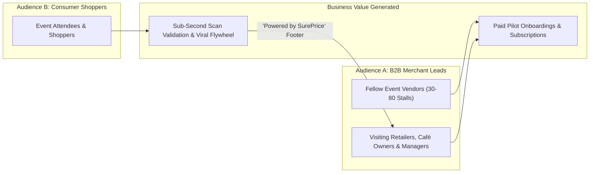
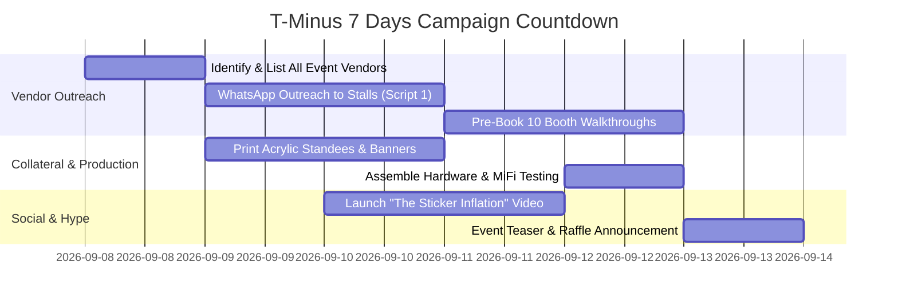
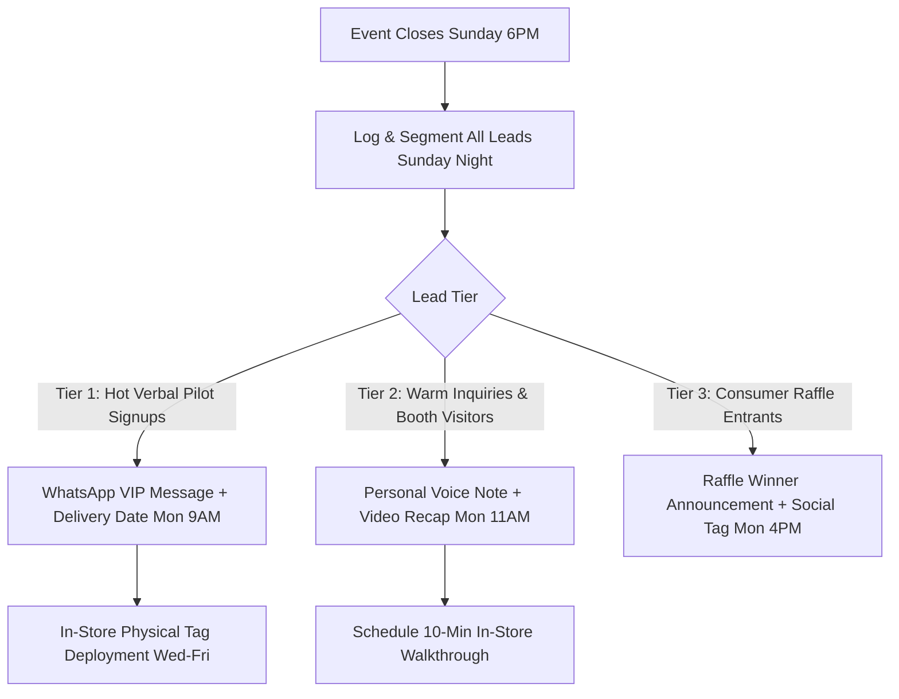

# SurePrice V2 — Pop-Up Event Master Marketing Playbook & Readiness Guide

**Event Duration:** 3 Days  
**Lead Time:** 7-Day Countdown  
**Target Market:** Physical Retailers, Supermarkets, Cafés, Bistros & Pop-Up Market Vendors in Nigeria (Lagos / Abuja)  
**Core Purpose:** Convert 30+ qualified merchant leads, secure 10 on-the-spot pilot onboardings, generate 500+ live customer scans, and capture high-converting video proof.  
**Exportable File:** Save to PDF or print directly from Markdown.

---

## 1. Executive Summary & Dual-Audience Strategy

At a 3-day physical pop-up market (e.g., EatDrinkLagos, Art X, GTCO Fair, Muri Okunola Park, Balmoral Hall), you are not marketing to just one group. You are operating a **dual-audience motion**:



### The Event Scoreboard (Targets)
- **Primary North Star:** **10 Confirmed Pilot Merchants** signed up with pre-provisioned accounts by end of Day 3.
- **Pipeline Metric:** **30+ High-Intent Qualified Merchant Leads** (Store/Restaurant name, decision-maker WhatsApp, SKU volume).
- **Technical Validation:** **500+ Physical QR Scans** logged in Supabase with $< 750\text{ms}$ sub-second resolution across MTN, Airtel, and Glo networks.
- **Content Asset Metric:** **15 Short Video Clips** (5 shopper scan reactions, 5 vendor interviews about sticker inflation, 5 demo walkthroughs).

---

## 2. Integrated Marketing Frameworks & Skill Synthesis

This playbook draws directly from the established skills library:

| Skill | Core Framework Applied | Pop-Up Event Execution |
| :--- | :--- | :--- |
| **`events`** | Universal Arc (20% event, 80% before & after) | 7-day pre-booking of fellow vendors; rapid 24–48h tiered follow-up before leads cool down. |
| **`marketing-ideas` (#121)** | Guerrilla Marketing & "Story over Campaign" | The "Inflation Sticker vs. 1-Tap QR" live speed race; physical price shock demonstration. |
| **`marketing-ideas` (#87)** | Powered-By Marketing & Viral Loops | Every shelf tag and menu scan carries *"Powered by SurePrice · Zero App Download · Get this for your store"*. |
| **`marketing-ideas` (#47)** | Founder-Led Sales & Floor Walking | Daily 9:00 AM "Vendor Row Walk" before doors open to pitch all 40+ stalls while they set up. |
| **`offers`** | The "Grand Slam" Risk-Reversal Offer | Zero-risk 60-day VIP Pilot + free acrylic hardware standees + done-for-you catalog import. |
| **`social`** | Real-Time Behind-the-Scenes & Reaction Clips | 10-second TikTok/Reel street-interview reactions: *"Guess how long it takes to change this price?"* |
| **`analytics`** | Event-Specific Attribution | Dedicated UTM parameters on all printed banners and flyers to isolate event conversion. |

---

## 3. Hardware & Software Readiness Master Checklist

In Nigerian pop-up environments, network congestion, sudden power outages, and bright sunlight are common failure modes. Prepare the following hardware and software stack:

### A. Hardware & Physical Infrastructure Checklist

| Item | Specification / Details | Qty | Priority | Done |
| :--- | :--- | :---: | :---: | :---: |
| **Primary MiFi / WiFi** | 5G/4G Mobile Router (MTN / Airtel 5G Broadband) with active data | 1 | `CRITICAL` | [ ] |
| **Backup SIM / Hotspot** | Secondary phone or MiFi on a *different* network carrier (failover) | 1 | `CRITICAL` | [ ] |
| **High-Capacity Power Banks** | 20,000mAh – 30,000mAh with fast PD charging (charges phones & MiFi) | 2 | `CRITICAL` | [ ] |
| **Heavy-Duty Extension Box** | Surge-protected multi-socket strip (3–5m cord) for booth power outlet | 1 | `HIGH` | [ ] |
| **iOS Demo Phone** | iPhone (iOS 16+) with clean camera lens & Safari bookmark | 1 | `CRITICAL` | [ ] |
| **Android Demo Phone** | Mid-tier Android (Tecno, Infinix, or Samsung) to prove compatibility | 1 | `CRITICAL` | [ ] |
| **Tablet / iPad** | Tablet in counter stand displaying live Merchant Admin Dashboard | 1 | `HIGH` | [ ] |
| **Acrylic Table Tents** | A6 & A5 Clear Acrylic Standees ($105 \times 148\text{mm}$) with demo QRs | 6 | `CRITICAL` | [ ] |
| **Shelf Wobblers / Clips** | Standard retail shelf tags ($70 \times 40\text{mm}$) mounted on sample shelf rail | 10 | `HIGH` | [ ] |
| **Roll-Up Pull Banner** | $85\text{cm} \times 200\text{cm}$ with high-contrast QR code visible from 3 meters | 1 | `CRITICAL` | [ ] |
| **Physical Handouts** | 1-Page Merchant ROI Leave-Behind Cards (heavy 350gsm cardstock) | 150 | `CRITICAL` | [ ] |
| **Lanyard & ID Badges** | Professional branded founder/team pass: "SurePrice Retail Ops" | 2 | `MEDIUM` | [ ] |
| **POS / Moniepoint Terminal** | OPAY / Moniepoint terminal or OPay app ready to accept pilot deposits | 1 | `MEDIUM` | [ ] |

---

### B. Software & Platform Readiness Checklist

| Software Item | Action Required | Verification Test | Done |
| :--- | :--- | :--- | :---: |
| **Demo Tenants Seeded** | Create 3 distinct demo accounts: (1) Artisan Café / Bakery, (2) Fashion & Accessories Stall, (3) Gourmet Grocer. | Login to each dashboard; confirm 8–15 high-res items per store with prices in ₦. | [ ] |
| **1-Tap Sync Speed Test** | Test updating a price on the merchant dashboard and watching it update on a scanned phone. | Verify latency is $< 1\text{s}$ over cellular 4G data. | [ ] |
| **Custom Event UTMs** | Generate event-isolated QR URLs: `https://sureprice.app/q/[code]?utm_source=popup_event&utm_medium=booth_qr`. | Confirm scans log correctly in Supabase `record_scan_and_increment`. | [ ] |
| **WhatsApp Direct Link** | Create a `wa.me` shortlink with pre-filled text: *"Hi SurePrice team, I'm at the pop-up event and want the VIP Merchant Pilot."* | Scan from camera; confirm WhatsApp opens instantly with text. | [ ] |
| **Mobile Webview Polish** | Check layout rendering on small screens (iPhone SE, small Tecno screen). | Verify no horizontal scroll; currency symbols (₦) align cleanly. | [ ] |
| **Offline / Edge Fallback** | Test behaviour when mobile airplane mode is toggled or network drops. | Ensure friendly cached view or instant retry banner appears. | [ ] |
| **Cloud Storage CDN** | Verify all demo product images are served from Supabase `catalog-media` bucket with 30-day cache headers. | Image loads $< 300\text{ms}$. | [ ] |

---

## 4. Phase 1: Pre-Event Marketing Playbook (T-Minus 7 Days to T-Minus 1 Day)

The pipeline is established before arriving at the venue. 80% of event ROI comes from pre-booking.



### Day 7 to Day 6: The "Fellow-Vendor Fast-Pass" Outreach
1. **Scrape or Request the Vendor Directory:** Contact the pop-up organizer or check the event Instagram page/tagged posts to find all 30–80 participating brands.
2. **Send Direct WhatsApp / Instagram DM to Every Vendor:**

> **WhatsApp Message to Fellow Vendors:**
>
> "Good day [Founder Name], saw that [Their Brand Name] is exhibiting at [Event Name] this weekend! 🎉
>
> Quick heads up: We know how chaotic counter pricing and customer crowds get at 3-day pop-ups. 
>
> We built **SurePrice** (cloud QR price tags and digital menus). For this event, we are giving 5 selected vendors an **Instant Digital Price Menu & Table Standee for FREE** so your customers can scan and view your products/prices on their phones with zero app download while your counter is busy.
>
> Would you like us to print a ready-to-use acrylic standee with your menu/catalog for your booth? Let me know your top 5 items and prices today and we'll deliver it right to your stall on Friday morning."

*Why this works:* It provides immediate physical value before asking for anything. You enter the event with 5 stalls already displaying *"Powered by SurePrice"* tags.

---

### Day 5 to Day 3: The Guerrilla Teaser Video Campaign
Post 2 short video assets (60–90 seconds) on LinkedIn, Instagram, and TikTok:

- **Video 1: "The ₦50,000 Sticker Headache"**
  - *Visual:* Show someone agonizingly peeling paper stickers off 20 jars and handwriting new prices with a marker.
  - *Cut to:* A phone tapping "₦7,500 $\rightarrow$ ₦9,000" in SurePrice. Scan the acrylic tag on camera—instant price change in 0.5s.
  - *CTA:* *"Visiting [Event Name] this weekend? Come to Booth [#] and try to beat our 1-second price challenge."*

- **Video 2: "Never Argue at the Checkout Again"**
  - *Hook:* *"Why do customers abandon shopping baskets at physical markets in Lagos?"*
  - *Core Point:* Price uncertainty. Shoppers hate asking for prices 10 times.
  - *Solution:* Dynamic QR tags.

---

### Day 2 to Day 1: Logistics & Pack-Up Checklist
- [ ] Confirm stall number, setup time, and power outlet location with event organizers.
- [ ] Charge all power banks, demo phones, and MiFi devices to 100%.
- [ ] Inspect printed A6 acrylic standees and roll-up banner under bright lighting.
- [ ] Seed test inventory and verify demo prices in the admin dashboard.

---

## 5. Phase 2: During-Event Marketing Execution (The 3 Days on the Ground)

### A. Booth Architecture & Visual Stopping Power
Most event booths fail because their signage is passive. Your booth must look like an interactive science lab for retail.

```
┌────────────────────────────────────────────────────────────────────────┐
│                        SUREPRICE LIVE DEMO STALL                       │
├────────────────────────────────────────────────────────────────────────┤
│                                                                        │
│   [ ROLL-UP BANNER ]                      [ DEMO DISPLAY TABLE ]       │
│  ┌───────────────────────┐               ┌──────────────────────────┐  │
│  │ STOP RE-STICKERING    │               │  [Acrylic Standee A]     │  │
│  │ SHELVES IN NIGERIA.   │               │   "Scan to Test ₦ Price" │  │
│  │                       │               │                          │  │
│  │ [ GIANT DEMO QR ]     │               │  [iPad - Admin View]     │  │
│  │                       │               │   Live 1-Tap Dashboard   │  │
│  │ Point phone camera.   │               │                          │  │
│  │ No app download.      │               │  [Android + iOS Phones]  │  │
│  └───────────────────────┘               │   Live scan stations     │  │
│                                          └──────────────────────────┘  │
│                                                                        │
│   [ INTERACTIVE HOOK BANNER ]: "THE 1-SECOND PRICE UPDATE CHALLENGE"   │
└────────────────────────────────────────────────────────────────────────┘
```

---

### B. The 2-Minute "Live Shock" Demo Script (For Visiting Merchants)

When a store owner, restaurant manager, or merchant stops at your booth:

1. **The Agitation (15s):**  
   *"With supplier costs jumping every month, how many hours does your team spend re-printing menus or stickering shelves?"*  
   *(Wait for their answer: they will invariably say it's exhausting).*

2. **The Demonstration (30s):**  
   *"Pick an item on this demo standee. It says ₦6,500. Take out your own phone and scan the QR code right now."*  
   *(They scan with native camera—it opens instantly in $< 750\text{ms}$).*  
   *"Now watch my screen. I’m changing the price to ₦8,000 on my dashboard. Hit refresh on your phone—or scan it again."*  
   *(It reflects immediately).*

3. **The Proof of Zero Friction (15s):**  
   *"Notice you didn’t have to download an app from Play Store or App Store? Works on any smartphone in Nigeria, even on 3G."*

4. **The Close / Offer (30s):**  
   *"We are onboarding 10 physical stores in Lagos as part of our Founders' Pilot Cohort this weekend. We come to your store, set up your digital tags, and give you 60 days free with custom acrylic holders included. What is your store name and WhatsApp?"*

---

### C. The Daily "Vendor Row Walk" (High-Conversion Play)
Do not sit in your booth waiting for leads. Every morning from 9:00 AM to 10:30 AM (before general attendees arrive), walk the floor:

1. Approach each stall owner while they are setting up their tables.
2. Say: *"Good morning! We’re at Booth [#]. We saw your display looks amazing. If you get a rush of customers later and people are asking 'how much is this?', here is a quick demo standee. You can update your prices on your phone in 1 tap so people scan instead of crowding your cash point."*
3. Hand them a pre-printed 1-page ROI leave-behind with a personalized note.
4. Record their name and stall number in your notebook/app.

---

### D. The Consumer Engagement Hook: "Scan & Win" Raffle
To generate 500+ live scans and build social buzz:
- **Signage:** *"Scan any 3 QR codes on this table to reveal the secret discount code & enter our ₦25,000 Pop-Up Shopping Voucher Raffle."*
- **Mechanism:** Shoppers scan the QR tag $\rightarrow$ lands on the SurePrice webview $\rightarrow$ views product details $\rightarrow$ clicks *"Enter Daily Raffle"* button $\rightarrow$ enters their Name & Instagram handle.
- **The Viral Footprint:** Every page they view has the prominent footer: *"Powered by SurePrice · Zero App Download · Want this for your business?"*

---

### E. Live Content Engine (Capturing Assets)
Treat the 3-day event as a content production studio:
- **Shopper Scan Reactions:** Film 5–10 second clips of attendees scanning a product with native camera: *"Wait, it opened in 1 second without downloading an app?"*
- **Merchant Interviews:** Ask stall owners: *"What’s the most annoying thing about updating prices in Nigeria right now?"*
- **Daily Recap Reel:** Post an end-of-day reel on Instagram & LinkedIn showing live scan volume, booth energy, and merchant onboarding.

---

## 6. The "Grand Slam" Pop-Up Pilot Offer

According to the `offers` framework, your event offer must eliminate all financial and operational risk:

```
┌────────────────────────────────────────────────────────────────────────┐
│                   THE SUREPRICE FOUNDER PILOT PACKAGE                  │
│                      (Exclusive to Pop-Up Attendees)                   │
├────────────────────────────────────────────────────────────────────────┤
│                                                                        │
│  1. 60-Day Full Access to SurePrice V2 Platform (Zero Subscription Fee)│
│  2. Free Starter Pack of 20 Custom Acrylic Shelf Standees / Tags      │
│  3. Done-For-You Catalog Onboarding (Send us your price list on       │
│     WhatsApp; our team imports all your SKUs within 24 hours)         │
│  4. Priority Same-Day WhatsApp Support Line                            │
│  5. Price Protection Guarantee: Zero price increases on your account   │
│                                                                        │
│  ⚡ TOTAL VALUE: ₦150,000                                              │
│  🔥 EVENT PILOT PRICE: FREE / ₦10,000 Refundable Setup Deposit         │
│  ⚠️ SCARCITY LIMIT: STRICTLY 10 MERCHANTS ACROSS THE 3-DAY EVENT       │
└────────────────────────────────────────────────────────────────────────┘
```

---

## 7. Phase 3: Post-Event Follow-Up & Conversion Engine (The 24–48 Hour Window)

Per the `events` skill, lead response rates decay by 50% every 24 hours. The entire post-event outcome depends on execution between Sunday evening and Tuesday afternoon.



### Lead Segmentation Matrix

| Tier | Definition | Action Window | Communication Channel | Goal |
| :--- | :--- | :---: | :--- | :--- |
| **Tier 1 (Hot)** | Merchants who agreed to the pilot, gave store details, or paid deposit. | Monday 9:00 AM | Personalized WhatsApp + Phone Call | Schedule physical store tag delivery. |
| **Tier 2 (Warm)** | Store/restaurant owners who took a demo, asked questions, took flyer. | Monday 11:00 AM | WhatsApp Voice Note + 1-Min Video Demo | Book in-store 10-minute demonstration. |
| **Tier 3 (Cold/Network)** | Event vendors or attendees who entered raffle. | Tuesday 10:00 AM | WhatsApp Broadcast / Email | Announce raffle winner + invite to waitlist. |

---

### Follow-Up Templates

#### Template 1: Tier 1 Hot Merchant (WhatsApp)
> *"Hello [Name], fantastic meeting you at [Event Name] on [Day]! 🚀*
>
> *I have reserved your **SurePrice 60-Day VIP Pilot** along with your 20 free acrylic shelf standees for [Store/Brand Name].*
>
> *Our onboarding team is setting up your catalog today. Could you send over your current price sheet or menu (PDF, Excel, or even a photo of your paper list) here on WhatsApp?*
>
> *We’ll have your digital catalog live and bring your printed tags to your store on [Wednesday/Thursday] morning. What time works best for you?"*

#### Template 2: Tier 2 Warm Merchant (WhatsApp Voice Note + Text)
> *(Send 25-second voice note mentioning their stall name and what they liked about the speed demo)*
>
> *Follow-up text:*  
> *"Hi [Name], here is that 30-second video demo of the 1-tap price update we walked through at [Event Name]: [Demo Video Link].*
>
> *We still have 3 slots left in our Lagos Pilot Cohort with free acrylic standees included. Would you be open to a 7-minute test at [Their Store Name] this week? I can bring sample tags over on Thursday."*

---

## 8. Master Event Run-of-Show Timetable

### T-Minus 7 Days to Event Eve

| Day | Primary Focus | Key Milestones & Deliverables |
| :--- | :--- | :--- |
| **Monday (T-7)** | Vendor Intelligence & Outreach | Collect list of all 30–80 vendors; send WhatsApp outreach offering free acrylic standees. |
| **Tuesday (T-6)** | Print Collateral Orders | Send roll-up banner, A6 acrylic standees, and 1-page ROI cards to printer. |
| **Wednesday (T-5)** | Software QA & Demo Seeding | Seed 3 demo stores in Supabase; verify sub-second load times on 4G cellular network. |
| **Thursday (T-4)** | Social Teaser Push | Publish Video 1 ("The Sticker Inflation Nightmare") across LinkedIn and Instagram. |
| **Friday (T-3)** | Hardware Assembly & Packing | Test dual MiFi routers (MTN + Airtel), charge all power banks, verify cables. |
| **Saturday (T-2)** | Collateral Pickup & QA | Inspect printed banner, acrylic standees, and handouts; pack booth storage bins. |
| **Sunday (T-1)** | Final Rehearsal & Setup Check | Walk through 2-minute demo script; confirm venue setup times with organizer. |

---

### The 3-Day Event Schedule

| Time Window | Day 1 (Friday) — Setup & Vendor Seeding | Day 2 (Saturday) — Peak Traffic & Live Demos | Day 3 (Sunday) — Closing Strong & Pilot Conversions |
| :--- | :--- | :--- | :--- |
| **08:30 – 10:00** | Booth build, banner assembly, MiFi & power setup. | Hardware battery check, test scan speed on crowd network. | Final stall walk: check in with pilot vendors from Day 1 & 2. |
| **10:00 – 11:30** | **Vendor Walk #1:** Pitch 20 stall owners during setup. | **Vendor Walk #2:** Follow up with vendors who showed interest. | Engage visiting supermarket & restaurant owners on morning walk. |
| **11:30 – 14:00** | Shopper gates open; initiate "Scan & Win" raffle challenge. | Peak foot traffic; run non-stop 2-minute live price demos. | Peak Sunday crowd; capture video testimonials and scan reactions. |
| **14:00 – 17:00** | Capture video reaction clips; live price update demos. | Run live "1-Second Price Challenge" with crowd participants. | Final push for last remaining slots in 10-merchant pilot cohort. |
| **17:00 – 19:00** | Daily lead tally; backup all contact entries on WhatsApp. | Day 2 review; schedule Monday appointments with hot leads. | Pack up booth; announce raffle winners on Instagram live; pack kit. |

---

### Post-Event Execution (T+1 to T+3 Days)

| Day | Timing | Action Item | Success Milestone |
| :--- | :--- | :--- | :--- |
| **Monday (T+1)** | 08:30 AM | Compile master spreadsheet of all leads, segmented by Tier 1, 2, and 3. | Clean database with zero missed contacts. |
| **Monday (T+1)** | 09:30 AM | Dispatch Template 1 to all Tier 1 Hot Leads via WhatsApp. | Confirm catalog delivery dates for at least 7 stores. |
| **Monday (T+1)** | 11:30 AM | Dispatch Template 2 + Voice Notes to all Tier 2 Warm Leads. | Secure 5 in-store demonstration walkthroughs. |
| **Tuesday (T+2)** | 10:00 AM | Publish Event Recap Reel & Case Study on LinkedIn and Instagram. | Tag participating vendors and event organizers for resharing. |
| **Wed–Fri (T+3–5)** | Full Days | Physical field visits: install acrylic standees in confirmed pilot stores. | First 5 live stores successfully scanning in production. |

---

## 9. Contingency & Troubleshooting Playbook

| Scenario | Immediate Remedy |
| :--- | :--- |
| **Venue cellular network gets congested / fails** | Switch to backup MiFi on secondary network (e.g. switch MTN to Airtel). If both stall, demonstrate using offline cached demo video on tablet while troubleshooting. |
| **Booth power socket dies** | Run all devices off the 30,000mAh PD power banks (provides up to 12 hours of continuous phone and router runtime). |
| **Shopper camera fails to scan QR** | Check angle and distance ($30\text{cm}$ recommended); ensure phone camera lens is wiped clean; provide backup direct shortlink (`sureprice.app/demo`). |
| **Merchant says: "I don't have time to update a dashboard"** | Emphasize done-for-you catalog onboarding: *"You don't touch the backend. Just send your supplier price changes on WhatsApp, and our concierge team updates it within 1 hour."* |

---

*Document compiled and verified for SurePrice V2 Nigeria Launch.*  
*Ready for immediate PDF export, print distribution, and field execution.*
